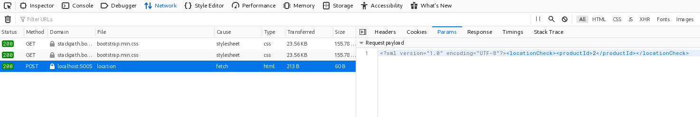
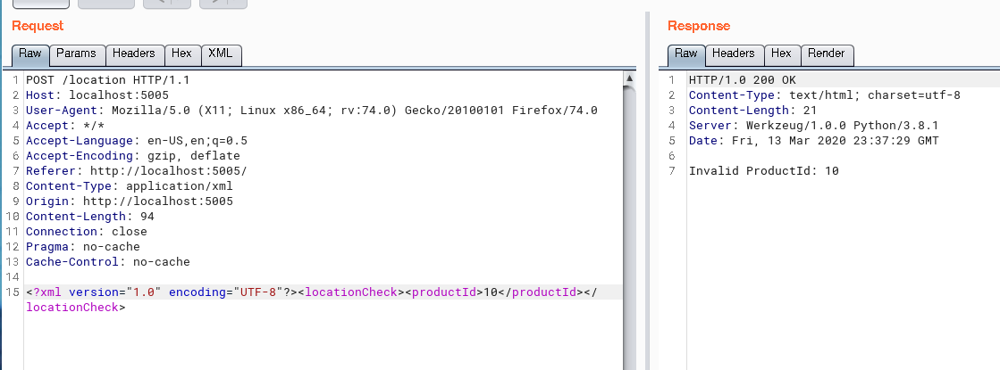
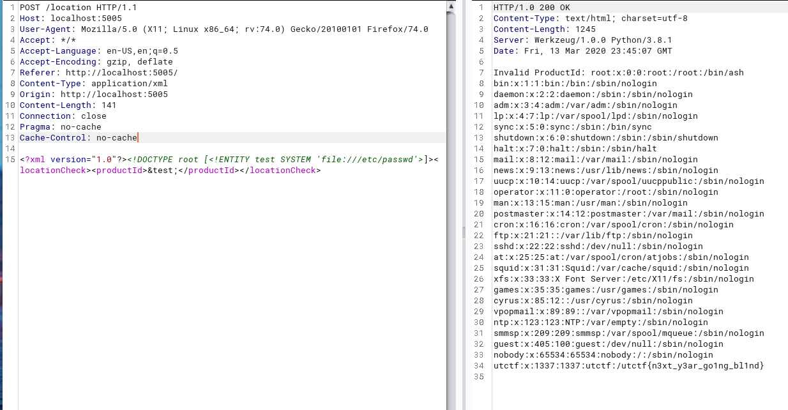

# Spooky Items
* **Event:** UTCTF
* **Problem Type:** Web
* **Point Value / Difficulty:** easy
* **(Optional) Tools Required / Used:** None required, Burp/Postman useful

[Burp](https://portswigger.net/burp) is a common web-proxy that allows you to
quickly capture, edit, and resend HTTP requests. It's pretty useful for seeing
the full response from applications and general web app security tasks.

## Overview

The problem was meant to be an easy XXE problem, a common vulnerability in web
applications that use XML for transporting data.

## Steps

#### Find where XML is Used

Once you load up the webpage, you'll find it's a simple webpage with 3 buttons that can check the nearby "coordinates" of a particular item.

After clicking around for a bit you'll notice that when you click the button, it
fires off a request with some XML as the request data.

#### Try to send some wrong stuff

Notice, in the XML sent to the server it uses an integer in the <productId> tag
to differentiate which item you want coordinates for.

If you throw in a wrong productId instead, it returns "Invalid Product Id:
<id>".

This will be the way you can read the output of the XXE :)

#### Look up xml vulnerabilities

If you look up XML vulnerabilities, the first thing that comes up is about XXE
attacks, there's tons of good resources to learn about them. I linked a couple
below.

Basically, XML allows these things called "Entities" that are used to define
shortcuts/macros to special characters, like macros. However, these "macros" can
do things like, pull from files if you allow "External entities". They can even
make network requests for files!

Example of Entity referencing a file:

`<!ENTITY writer SYSTEM "https://www.w3schools.com/entities.dtd">`

Generally, a well configured server would disallow External Entities for this
reason.

The document type definition (DTD) contains declarations about the structure of
an XML document, and the DTD is declared with a `DOCTYPE` element at the start
of the XML (Portswigger).

This is necessary to know, as to reference an entity you have to create a
document.

In the following document, `foo`, any reference of the entity `myentity` will be
replaced with the respective value, `my entity value`.

`<!DOCTYPE foo [ <!ENTITY myentity "my entity value" > ]> `

#### Get some malicious xxe

[PayloadsAllTheThings](https://github.com/swisskyrepo/PayloadsAllTheThings) has
some pretty good stuff:

First thing they have under "Classic XXE":

`<?xml version="1.0"?><!DOCTYPE root [<!ENTITY test SYSTEM 'file:///etc/passwd'>]><root>&test;</root>`

This XXE declares a document and an external entity that loads '/etc/passwd/'.
You then have to tailor the XXE payload to the problem, which basically just
involves adding the <locationCheck> and <productId> tags.

`<?xml version="1.0"?><!DOCTYPE root [<!ENTITY test SYSTEM 'file:///etc/passwd'>]><locationCheck><productId>&test;</productId></locationCheck>`

After passing that XML to the server you get back the contents of /etc/passwd!
At the bottom is the flag, which is the password for the `utctf` user.

`utctf:x:1337:1337:utctf:/utctf{n3xt_y3ar_go1ng_bl1nd}`

## Resources
[Portswigger XXE](https://portswigger.net/web-security/xxe)

[Owasp XXE](https://owasp.org/www-community/vulnerabilities/XML_External_Entity_(XXE)_Processing)
